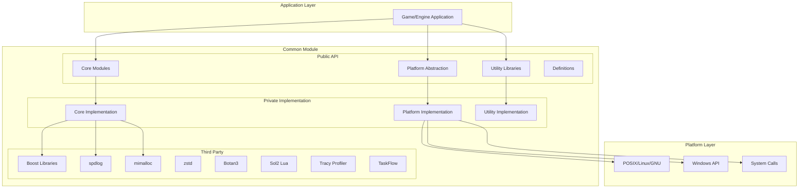
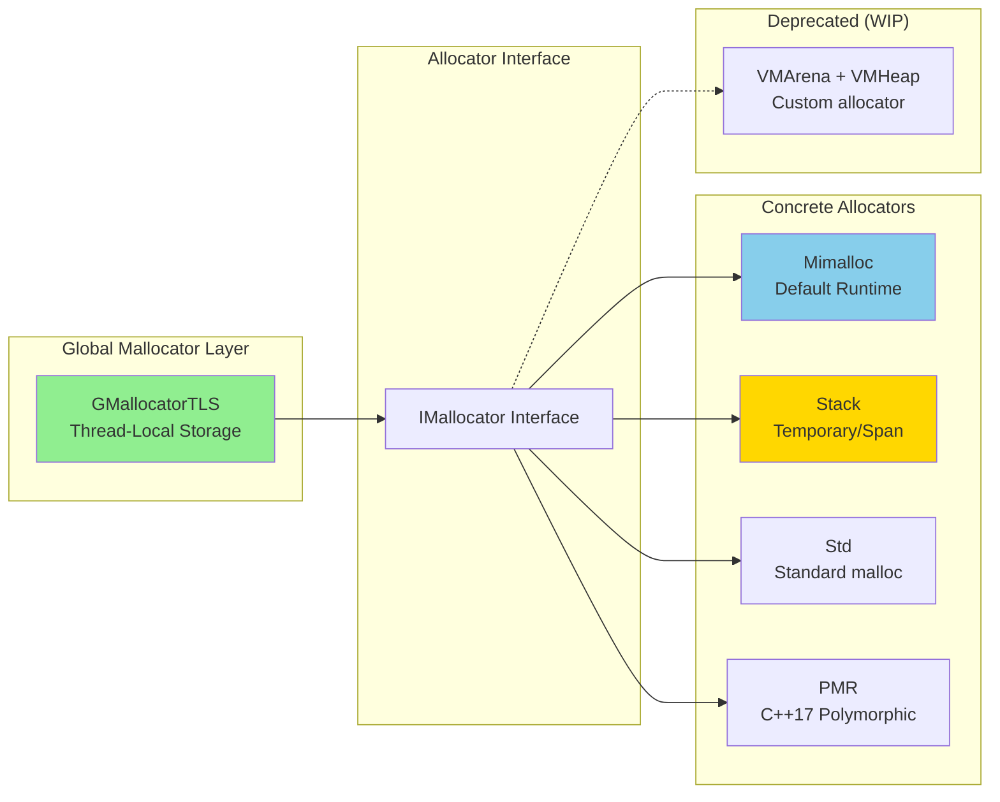
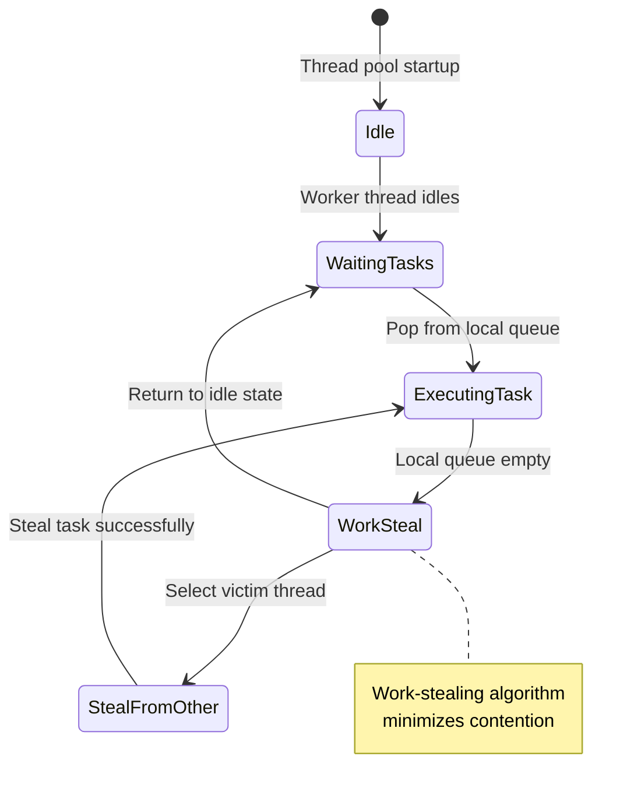
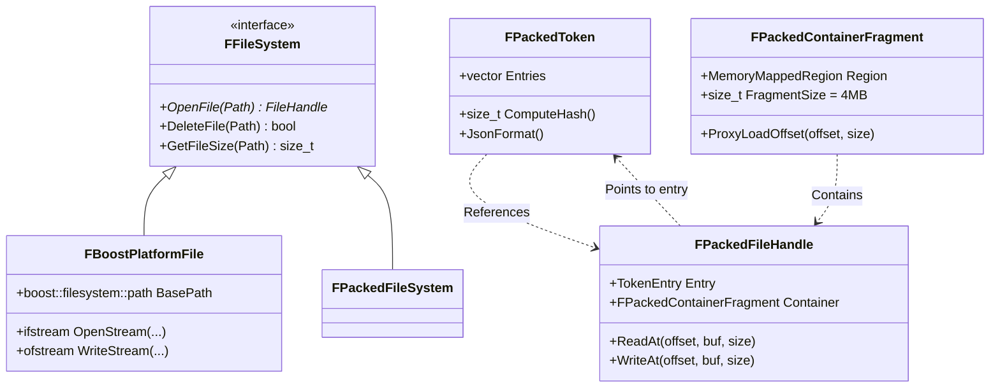
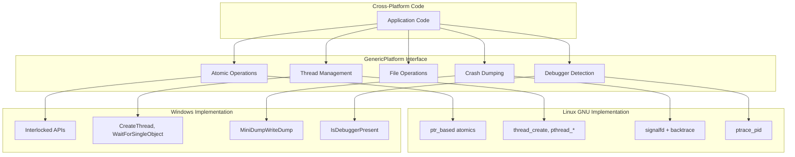
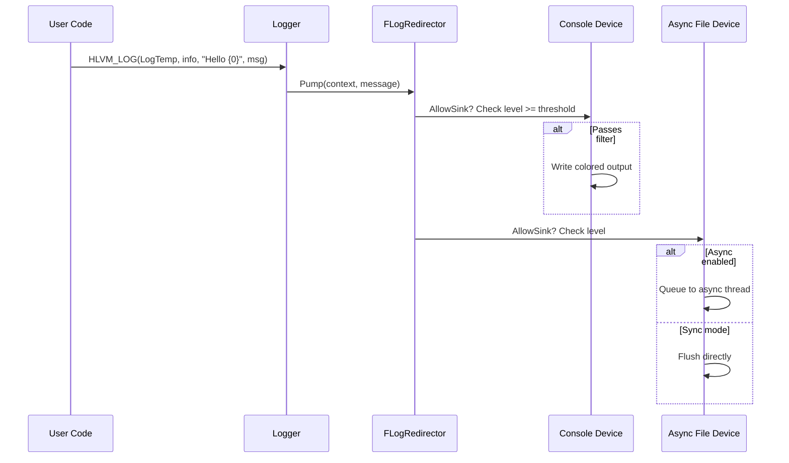
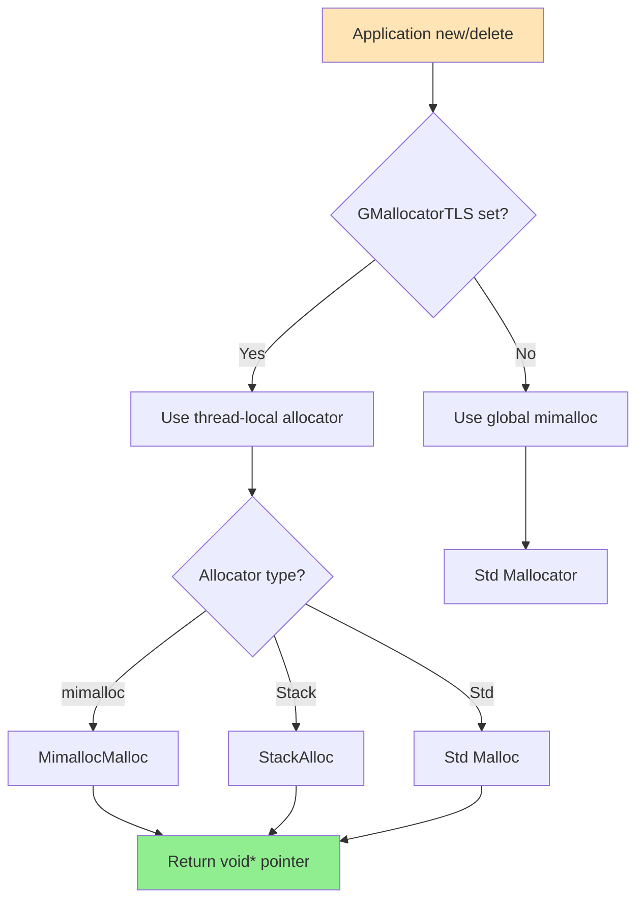

# HLVM-Engine Common Module Architecture

## Overview

The HLVM-Engine Common module is the foundational layer providing essential infrastructure for game engine operations. Inspired by Unreal Engine's core systems, it delivers custom implementations for memory management, logging, file handling, parallelism, and platform abstraction.

**Primary Goals:**
1. Provide UE5-like developer experience with improved pak文件查读 (pak file inspection)
2. Implement superior memory management compared to UE5
3. Include built-in telemetry/profiling systems  
4. Master Linux development toolchain and C++20 features

## System Architecture

### High-Level Component Diagram



### Architecture Principles

1. **Layered Design**: Strict separation between public API (headers) and private implementation (source files)
2. **Platform Independence**: Abstract all platform-specific code through GenericPlatform interface
3. **RAII Pattern**: Resource management via RAII throughout the codebase
4. **Zero-Copy Optimization**: Minimize data copies in hot paths (packed archives, string handling)
5. **Compile-Time Safety**: Extensive use of constexpr, concepts, and template metaprogramming

## Core Subsystems

### 1. Memory Management Hierarchy



**Key Features:**
- Thread-local default allocator (`GMallocatorTLS`) via TLS
- Runtime allocator swapping using scoped variables
- Stack allocator 2-3x faster than mimalloc for temporary allocations
- Custom mimalloc integration with global `new`/`delete` overrides
- Reference-counted smart pointers (`RefCountPtr`, `RefCountable`)
- Pool-based FName/FText string pooling (WIP)

### 2. Logging System Architecture

```mermaid
graph TB
    subgraph "User Code"
        LogMacro[HLVM_LOG(Category, Level, Format, ...)]
    end
    
    subgraph "Logger Infrastructure"
        Category[FLogCategory<br/>LogCrashDump, LogTemp]
        Context[FLogContext<br/>Category, Level, File, Line]
        Redirector[FLogRedirector<br/>Singleton Manager]
    end
    
    subgraph "Devices (Sinks)"
        Console[spdlog stdout_color_sink<br/>Colored console output]
        AsyncFile[spdlog async<br/>Rotating file sink]
        SyncFile[sync flush<br/>Warn/Error/Critical errors]
    end
    
    LogMacro --> Category
    LogMacro --> Context  
    Redirector --> Console
    Redirector --> AsyncFile
    Redirector --> SyncFile
    Context -->|Pump messages | Redirector
    
    style LogMacro fill:#FFE4B5
    style Redirector fill:#FFB6C1
    style Console fill:#90EE90
    style AsyncFile fill:#E6E6FA
```

**Key Features:**
- UE5-style log categories (`DECLARE_LOG_CATEGORY`, `HLVM_LOG` macro)
- Compile-time log level filtering (no overhead below category threshold)
- Async logging for trace/debug/info levels via spdlog async queue
- Synchronous flush for warn/error/critical to ensure durability
- Crash dump stacktrace integration via `backwardcpp` library

### 3. Parallelism & Concurrency Model



**Concurrency Primitives Provided:**

| Primitive | Type | Description | Performance Note |
|-----------|------|-------------|------------------|
| `SpinLock` | Mutex-free `std::atomic_flag` | Busy-wait lock with `_mm_pause` mitigation | ~1.5x faster than boost::lockfree::queue |
| `RWLock` | Reader-writer variant | Permissive reads, exclusive writes | Better read-throughput scenarios |
| `ConcurrentQueue` | Lock-free SPSC/MPSC/MPMC | Multiple queue configurations | Optimized with condition variables |
| `WorkStealThreadPool` | Task pool with stealing | std::future returns, work stealing | Optimal for task parallelism |
| `FiberPool` | coroutine fibers | boost::fibers-based (WIP) | Experimental, less stable than thread pool |

### 4. File System Abstraction



**FS Strategies:**
1. **Boost Platform**: Standard filesystem using boost::filesystem for local project files
2. **Packed Archives**: Custom binary format with token metadata, memory-mapped container fragments
   - Token files store offsets/sizes/compression flags instead of strings (hash-based lookup)
   - Debug JSON format for human-readable inspection
   - 4MB fragment loading for minimal RSS footprint

### 5. Platform Abstraction Layer (PAL)



**Abstraction Coverage:**
- Atomic pointer operations (CAS, exchange, fetch_add)
- Thread utilities (TID retrieval, affinity masks, creation)
- Debugger detection (`ptrace` on Linux, `IsDebuggerPresent` on Windows)
- Stack trace capture (`backwardcpp` library, platform-specific unwinding)
- Crash dump generation (mini-dumps on Windows, core dumps + stacktraces on Linux)

## Data Flow Patterns

### Request Handling Pipeline



### Memory Allocation Flow



## Third-Party Integration Matrix

| Library | Purpose | Integration Depth | License |
|---------|---------|-------------------|---------|
| **Boost.Filesystem** | Cross-platform file paths | Heavy usage in FilePath, FileSystem | BSFL |
| **spdlog** | High-performance logging | Full integration with async sinks | MIT |
| **mimalloc** | Fast memory allocator | Global new/delete override, runtime switching | MIT |
| **zstd** | Compression/decompression | Custom wrapper for pak archives | BSD-3 |
| **Botan3** | Cryptography (RSA) | Encryption for sensitive configs/data | Apache 2.0 |
| **Sol2** | Lua bindings | Scripting support for game modding | MIT |
| **Tracy** | CPU profiling | Optional integration for performance profiling | Zlib |
| **TaskFlow** | Task-parallel patterns | Template-based parallel algorithms | MIT |
| **Effil** | Lightweight threading | Alternative threading model | BSL 1.0 |
| **magic_enum** | Enum reflection | Used in serialization, debugging | MIT |
| **fmt** | String formatting | Backend for FString formatting | MIT |

## Build System Integration

The Common module integrates with PyCMake custom build system:

```cmake
pycmake_add_library(
    name="HLVM_Common"
    visibility="PUBLIC"
    sources PRIVATE "${COMMON_PRIVATE_SOURCES}"
                   PUBLIC "${COMMON_PUBLIC_HEADERS}"
    dependencies 
        PUBLIC Boost::filesystem
               spdlog::spdlog
               mimalloc
               zstd
               Botan3::botan
    defines 
        HLVM_BUILD_DEBUG / HLVM_BUILD_RELEASE
        HLVM_THREAD_SAFETY_ANALYSIS
)
```

**Build Configuration Flags:**
- `HLVM_BUILD_DEBUG`: Enables debug logging, assertions
- `HLVM_BUILD_RELEASE`: Strips debug symbols, enables optimizations  
- `HLVM_SPDLOG_USE_ASYNC`: Toggle async logging (enabled in Release)
- `HLVM_THREAD_SAFETY_ANALYSIS`: Enable Clang thread safety checks

## Design Tradeoffs

### Why Thread-Local Storage (TLS) for Allocator?

**Pros:**
- Zero contention for per-thread allocations
- Consistent with UE5's FMultithreadedMalloc pattern  
- Safe for nested allocator swapping within same thread

**Cons:**
- Memory leak risk if thread exits without cleanup
- Requires explicit scope guards for temporary allocators

### Why Work-Stealing vs Fixed Task Queues?

**Pros:**
- Load balancing across threads automatically
- Better cache locality (stealer accesses owner's queue)
- Minimal synchronization overhead

**Cons:**
- More complex implementation
- Victim selection algorithm adds minor overhead

### Why Packed Archives with Hash Tokens?

**Pros:**
- Smaller metadata (hash values vs full path strings)
- Faster lookups (integer comparison vs string match)
- Harder to reverse-engineer at runtime

**Cons:**
- Loss of human readability in production builds
- Requires separate debug token JSON for troubleshooting

## Future Roadmap

1. **VM Allocator Completion**
   - Move VMMallocator from deprecated to production
   - Implement lock-free free list sharding
   - Add arena-level fragmentation tracking

2. **ConstString Pool Enhancement**
   - Complete FName/FText pooling implementation  
   - Add atomic reference counting
   - Optimize for lock-free access

3. **Async I/O Improvements**
   - Replace synchronous packed file handles with async variants
   - Integrate io_uring on Linux for zero-copy reads

4. **Parallelism Expansion**
   - Complete FiberPool work-stealing issues
   - Add GPU compute task scheduler integration

5. **Telemetry System**
   - Extend ProfilerStats beyond CPU metrics
   - Add memory allocation statistics tracking
   - Export to external monitoring systems
