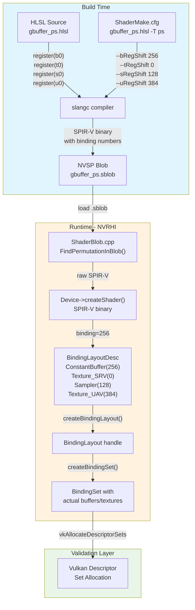

# Deferred Shading Binding System - Technical Reference

## Overview

The HLVM-Engine deferred shading system uses a **4-stage binding pipeline** that transforms HLSL register declarations into NVRHI binding slots.

---

## Binding Pipeline Diagram



---

## The 4 Stages

### Stage 1: HLSL Source Register Declaration

In your HLSL shader, you declare resources with `register()`:

```hlsl
// gbuffer_ps.hlsl
cbuffer MaterialConstants : register(b0)  // Buffer at register b0
Texture2D t_MyTexture : register(t0);    // Texture at register t0
SamplerState s_MySampler : register(s0);  // Sampler at register s0
RWTexture2D<float4> u_Output : register(u0);  // UAV at register u0
```

These `register()` declarations define the **logical slot** in HLSL.

---

### Stage 2: slangc Compilation with Register Shifts

The ShaderMake.cfg passes register shift arguments to `slangc`:

```
# ShaderMake.cfg
gbuffer_ps.hlsl -T ps
```

ShaderMakeBuild.py runs slangc with these shifts:

```bash
slangc -target spirv \
    --bRegShift 256 \
    --tRegShift 0 \
    --sRegShift 128 \
    --uRegShift 384 \
    -o gbuffer_ps.sblob gbuffer_ps.hlsl
```

**What the shifts do:**

| Shift | HLSL Register | Adds | Result |
|-------|---------------|------|--------|
| `--bRegShift 256` | b0 | 256 | SPIR-V binding **256** |
| `--tRegShift 0` | t0 | 0 | SPIR-V binding **0** |
| `--sRegShift 128` | s0 | 128 | SPIR-V binding **128** |
| `--uRegShift 384` | u0 | 384 | SPIR-V binding **384** |

---

### Stage 3: SPIR-V Binary with Binding Numbers

After compilation, the SPIR-V contains `OpDecorate` instructions with the final binding numbers:

```spv
OpDecorate %t_MyTexture Binding 0        ; t0 → 0
OpDecorate %s_MySampler Binding 128     ; s0 → 128
OpDecorate %u_Output Binding 384        ; u0 → 384
OpDecorate %MaterialConstants Binding 256  ; b0 → 256
```

The SPIR-V is wrapped in an **NVSP blob** (12-byte header + SPIR-V data).

---

### Stage 4: NVRHI Runtime Binding

At runtime, ShaderMake's `FindPermutationInBlob()` extracts the SPIR-V. Then you create a `BindingLayoutDesc` that **matches the SPIR-V bindings exactly**:

```cpp
// FDeferredLightingPass.cpp - CreateBindingLayout()

nvrhi::BindingLayoutDesc LayoutDesc;
LayoutDesc.setVisibility(nvrhi::ShaderType::Compute);

// Must match SPIR-V bindings exactly!
LayoutDesc.addItem(nvrhi::BindingLayoutItem::ConstantBuffer(256));  // b0 → 256
LayoutDesc.addItem(nvrhi::BindingLayoutItem::Texture_SRV(0));         // t0 → 0
LayoutDesc.addItem(nvrhi::BindingLayoutItem::Texture_SRV(1));         // t1 → 1
LayoutDesc.addItem(nvrhi::BindingLayoutItem::Texture_SRV(2));         // t2 → 2
LayoutDesc.addItem(nvrhi::BindingLayoutItem::Texture_UAV(384));       // u0 → 384

BindingLayout = Device->createBindingLayout(LayoutDesc);
```

Then create a `BindingSet` that binds actual resources to those slots:

```cpp
nvrhi::BindingSetDesc SetDesc;
SetDesc.addItem(nvrhi::BindingSetItem::ConstantBuffer(256, LightingBuffer));
SetDesc.addItem(nvrhi::BindingSetItem::Texture_SRV(0, GBuffer->GetDepthTexture()));
SetDesc.addItem(nvrhi::BindingSetItem::Texture_SRV(1, GBuffer->GetTexture(...)));
SetDesc.addItem(nvrhi::BindingSetItem::Texture_SRV(2, GBuffer->GetTexture(...)));
SetDesc.addItem(nvrhi::BindingSetItem::Texture_UAV(384, OutputTexture));

BindingSet = Device->createBindingSet(SetDesc, BindingLayout);
```

---

## Common Mistakes

### Mistake 1: Binding Number Mismatch

```cpp
// HLSL: register(b0) --bRegShift 256 → SPIR-V binding 256
// But C++ declares:
LayoutDesc.addItem(nvrhi::BindingLayoutItem::ConstantBuffer(0));  // WRONG!
```

**Result:** Validation error or wrong resource bound.

### Mistake 2: Missing Binding Offset Setting

```cpp
// WRONG - defaults to offset 256!
nvrhi::BindingLayoutDesc LayoutDesc;

// CORRECT - set offsets to 0 to match SPIR-V bindings directly
nvrhi::VulkanBindingOffsets Offsets;
Offsets.setConstantBufferOffset(0)
       .setShaderResourceOffset(0)
       .setSamplerOffset(0)
       .setUnorderedAccessViewOffset(0);
LayoutDesc.setBindingOffsets(Offsets);
```

### Mistake 3: Forgetting isConstantBuffer and keepInitialState

```cpp
// WRONG - will fail at binding time
nvrhi::BufferDesc desc;
desc.byteSize = 256;
// Missing: isConstantBuffer = true, keepInitialState = true

// CORRECT
nvrhi::BufferDesc desc;
desc.byteSize = 256;
desc.isConstantBuffer = true;
desc.initialState = nvrhi::ResourceStates::ConstantBuffer;
desc.keepInitialState = true;
```

---

## Complete Example: FDeferredLightingPass

### HLSL (deferred_lighting_cs.hlsl)
```hlsl
cbuffer LightingConstants : register(b0)  // bRegShift 256 → binding 256
{
    float3 LightDir;
    float LightIntensity;
    float3 AmbientColor;
    float _pad;
};

Texture2D t_GBuffer0 : register(t0);  // tRegShift 0 → binding 0
Texture2D t_GBuffer1 : register(t1);  // tRegShift 0 → binding 1
Texture2D t_GBuffer2 : register(t2);  // tRegShift 0 → binding 2

RWTexture2D<float4> u_Output : register(u0);  // uRegShift 384 → binding 384
```

### C++ (FDeferredLightingPass.cpp)
```cpp
bool FDeferredLightingPass::CreateBindingLayout()
{
    nvrhi::BindingLayoutDesc LayoutDesc;
    LayoutDesc.setVisibility(nvrhi::ShaderType::Compute);

    // Set binding offsets to 0 to match SPIR-V binding numbers directly
    nvrhi::VulkanBindingOffsets Offsets;
    Offsets.setConstantBufferOffset(0)
           .setShaderResourceOffset(0)
           .setSamplerOffset(0)
           .setUnorderedAccessViewOffset(0);
    LayoutDesc.setBindingOffsets(Offsets);

    // b0: LightingConstants - bRegShift 256 → SPIR-V binding 256
    LayoutDesc.addItem(nvrhi::BindingLayoutItem::ConstantBuffer(256));
    // t0-t2: GBuffer textures - tRegShift 0 → SPIR-V bindings 0-2
    LayoutDesc.addItem(nvrhi::BindingLayoutItem::Texture_SRV(0));
    LayoutDesc.addItem(nvrhi::BindingLayoutItem::Texture_SRV(1));
    LayoutDesc.addItem(nvrhi::BindingLayoutItem::Texture_SRV(2));
    // u0: Output - uRegShift 384 → SPIR-V binding 384
    LayoutDesc.addItem(nvrhi::BindingLayoutItem::Texture_UAV(384));

    BindingLayout = Device->createBindingLayout(LayoutDesc);
    return BindingLayout != nullptr;
}
```

---

## Binding Slot Reference Table

| Shader Type | HLSL Register | slangc Shift | SPIR-V Binding | NVRHI Item |
|-------------|---------------|--------------|---------------|------------|
| Constant Buffer | b0 | --bRegShift 256 | 256 | ConstantBuffer(256) |
| Constant Buffer | b1 | --bRegShift 256 | 257 | ConstantBuffer(257) |
| Constant Buffer | b2 | --bRegShift 256 | 258 | ConstantBuffer(258) |
| Texture SRV | t0 | --tRegShift 0 | 0 | Texture_SRV(0) |
| Texture SRV | t1 | --tRegShift 0 | 1 | Texture_SRV(1) |
| Sampler | s0 | --sRegShift 128 | 128 | Sampler(128) |
| Sampler | s1 | --sRegShift 128 | 129 | Sampler(129) |
| Texture UAV | u0 | --uRegShift 384 | 384 | Texture_UAV(384) |
| Texture UAV | u1 | --uRegShift 384 | 385 | Texture_UAV(385) |

---

## File Locations

- **HLSL Source:** `Engine/Source/Runtime/Test/TestDeferredShading_Data/`
- **ShaderMake Build:** `Engine/Source/Common/ShaderMakeBuild.py`
- **Runtime Blob Loading:** `Engine/Source/Runtime/Private/Renderer/ShaderMake/ShaderBlob.cpp`
- **Binding Layouts:** `Engine/Source/Runtime/Private/Renderer/Deferred/F*Pass.cpp`

---

*Document generated: 2026-04-22*
*Part of Vibe_Coding/18_HLVM_Deferred*